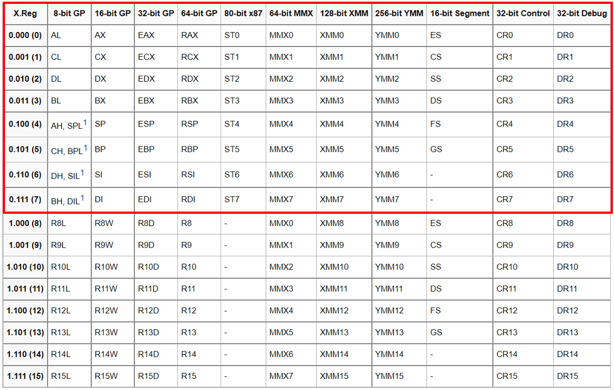

# Predict Assembly的理论与实现

## 概述

Predict Assembly算法主要分为两大部分

* 第一部分是通过**ngram算法**对数据集中的二进制文件建立ngram数据库，以便进行后续计算

* 第二部分是通过预测反汇编技术，根据输入的Yara规则得到所有符合条件的，可能与该条Yara规则匹配的汇编指令序列，之后通过先前建立的ngram数据库，近似计算得出这一系列汇编指令序列可能出现的概率，从而得到一个评估Yara规则在数据集中误匹配可能性的指标。

该算法总体架构如下：


## 第一部分

第一部分的核心组件就是ngram算法模块，该模块的输入为二进制可执行文件数据集，输出为从数据集中各个二进制可执行文件提取的指令ngram信息

该模块的具体架构如下：


具体介绍这几个步骤

* **预处理：** 主要是通过工具正确获得可执行文件内的有效代码，提取后保存其二进制串

* **ngram提取算法：** 将预处理文件中保存的二进制串先经过反汇编，再通过ngram的滑动窗口算法提取ngram指令串
  
  如上图中对3条指令提取2-gram，可以提取得到2个2-gram指令串

* **ngram normalize算法：** 该算法对提取的指令进行normalize（规范化），关于normalize算法的讨论见 [ngram normalize算法](#ngram normalize算法)

* **ngram数据库：** normalize处理后的ngram将被保存到数据库中，数据库会记录每个ngram对应的指令序列在数据集中出现的**频数**

### 预处理

#### 预处理过程的技术细节

##### 反汇编框架提取函数

预处理部分先使用了二进制分析框架radare2对输入的二进制文件进行处理，之后将radare2识别到的所有函数对应的二进制串保存为.asmdump预处理文件（因此在之后的ngram算法中，只会提取这些被正确识别并保存的函数中的指令）。

这里采用二进制分析框架预先提取函数的原因是这样可以提高获取到的反汇编内容的准确性，尤其是考虑到数据集中可能包含加壳过的二进制文件。若使用如objdump这类工具直接进行反汇编，则可能会误将许多数据内容误识别为指令，使得之后提取的ngram数据集中出现很多误报（见下文）

##### 误报与漏报

在这一问题的语境下，我们对误报与漏报做如下的定义：

* 误报：某个二进制串原本作为数据出现在文件中，但被误识别为指令

* 漏报：某个二进制串本应被识别为指令，但被当做数据从而没有被纳入ngram数据库中

很显然，我们预先使用二进制分析框架提取函数是为了降低误报率，当然这也会直接导致漏报率的提升。但在这里我们认为降低误报率更为重要，因为在后面的ngram概率计算模块中，我们需要使用提取出的ngram数据库建立的概率模型来对规则进行评估，若数据库中包含过多实际不存在的指令，则会对整体的概率造成一定的扰动

```
例如在实际的二进制文件中经常出现一长串的00
00 00 00 00
若这串数据被当做指令，则会被反汇编为
add    BYTE PTR [eax],al
add    BYTE PTR [eax],al

这将导致
add mem, reg
相关的指令概率异常地高
```

而相对来说，漏报对于概率模型的扰动则不是那么明显。因为漏报可以看做是对于每个二进制文件，都选取其指令的一个子集进行统计，而这种方式从理论上来说不会过多的影响概率分布（准确来说，若选取子集的方式是随机选取才不会影响，而这边的选取则依赖于函数识别的启发式算法，但考虑到指令串在二进制文件中的分布也具有一定的随机性，因此可以推断漏报对于概率模型的影响较小）

##### 框架的选用

在选型时，我也考察了多个比较常用的二进制分析框架，下表分析了各个工具的优劣

|         | 函数识别准确性 | 分析速度 | 适配难度 |
| ------- | ------- | ---- | ---- |
| IDA Pro | 高       | 一般   | 高    |
| Radare2 | 一般      | 快    | 低    |
| Angr    | 较高      | 很慢   | 低    |
| BAP     | 低       | 较快   | 低    |

实际上分析效果最好的应该是IDA Pro，但其是一个交互式二进制分析框架，这导致难以使用其对二进制文件进行批量分析

常用的angr框架最大的问题则是分析速度与占用的资源，这使得我们难以使用angr对上万个样本的数据集进行分析

而对部分样本的测试表明，虽然Radare2对函数识别的准确性低于IDA Pro和Angr，但大多数情况下与效果最好的IDA Pro相比，Radare2能正确还原90%以上的函数，因此这边选用了Radare2

### ngram normalize算法

ngram技术最开始解决的问题是NLP（自然语言处理）问题，但在NLP问题中实际上不存在所谓的normalize算法，这个算法是将ngram算法引入二进制分析后才出现的。

引入这一类算法的根本原因在于：对于机器语言（或汇编语言）来说，存在大量语法（syntax）不同但语义（semantics）类似的情况，如：

```
83 c0 01                add    eax,0x1
与
83 c0 02                add    eax,0x2
```

可以看到它们的语法（二进制表示）是不同的，但语义是类似的，都是给寄存器加上一个数。

而由于几乎所有的指令都是由相似的操作和操作数组成的，且操作数往往可以包含一个极大的空间，如

```
b8 01 00 00 00          mov    eax,0x1
```

其中这里后4字节都是立即数，其可以由0~0xFFFFFFFF，共有4294967296种可能。这说明再大的数据集都难以涵盖所有的情况，因此需要一个算法来规约这些语义类似的指令

#### 现有的normalize方法

[Richard][1]归纳并评估了一系列文章中的ngram normalize方法，主要分为下列两种

* Instruction Only  该方法直接使用助记符或opcode，在[MutantX-S][2]（使用opcode）、[shabtai][3]（使用助记符）等文章中均使用了该方法，此外在[Richard][1]的文章中还对该方法进行了改进，采用第一位opcode+助记符的形式来避免指令的歧义

* Instructions with Parameter Type  该方法使用助记符或opcode，加上操作数类型，在[Masud][4] （使用助记符和操作数类型）、[ByteWeight][5] （使用助记符，以及对如立即数等元素进行了normalize）

需要注意的是，上述ngram normalize方法除ByteWeight外大多数都是在机器学习分类方法中被使用，在这类方法中，经过normalize算法后的ngram直接或间接作为特征向量用于训练分类器，因此与我们的方法实际上存在一些差别。此外在[Richard][1]的文章中发现，在这类方法中使用normalize算法存在一个问题：由于normalize算法前后会丢失一部分信息，这部分信息丢失似乎会导致算法训练时的过拟合。

#### Predict Assembly对normalize算法的需求

##### 与机器学习算法中normalize算法的区别

在Predict Assembly中，ngram的使用与上面描述的机器学习算法实际上有着本质上的区别：在上述的机器学习方法中，采集到的ngram是直接或间接作为特征向量来训练的，而Predict Assembly中的ngram是利用了马尔科夫链的原理，直接作为贝叶斯模型使用，因此它是一个**概率模型**。从原理上来看其实更类似于[ByteWeight][5]，而ByteWeight在设计normalize算法时的粒度是比较细的：它只对立即数等元素进行了normalize，而对类似寄存器等并不会进行任何处理

诚然，理论上来说，normalize算法粒度过粗（将太多不同的指令归为同一类）会带来概率的失真，但粒度过细会使得数据集不够而导致每一类指令的样本数不具统计意义，这种问题在ByteWeight中可能不明显（因为它使用的算法是前缀树而非ngram，而前缀树从原理上更像是2-gram），但像Predict Assembly这样使用了4-gram时就尤为明显了。这里用当前的数据库来说明该问题：

```
当前实验的数据库来自于 个文件
其中共解析了 条指令
1-gram数据的大小为 条（这个数据说明了在使用当前的normalize算法时，上述指令一共会被分类为几种）
因此理论上4-gram的空间大小为 ^4=
实际上4-gram数量为 条
其中出现频数小于10的4-gram共有 条
```

##### normalize算法的假设

作为概率模型，Predict Assembly的normalize算法实际上是在满足这样一个假设：若两条指令被normalize算法规约为同一类指令，则意味着我们认为这两条指令出现的概率是相同的。

举个例子，若我们的normalize算法不考虑指令具体使用到的寄存器，即

```
push eax
push ebx
```

这两条指令均会被normalize算法规约为

```
push reg
```

则意味着我们认为 `push eax` 和 `push ebx` 两条指令的概率是相同的，不需要进行区分

##### normalize算法的设计目标

**综上所述，我们的normalize算法需要尽量地保证当几条语法不同的指令被归为同类指令时，它们在程序中出现的概率是相近的**

遗憾的是，目前我没有找到专门统计各种指令实际在程序中出现概率的研究工作（即使有，我认为统计结果也强依赖于取用的数据集），因此我们无法从概率模型本身出发来设计上述算法，所以退而求其次的方法就是尽量通过语义的一致性来保证normalize算法的有效性。

此外，normalize算法应从下列三个方面考虑对于算法泛化性的平衡

* 泛化性可以使得算法在面对语法不同但语义类似的指令序列时表现出鲁棒性，从而正确处理如编译器优化等带来的变化

* 泛化性还可以极大地缩小样本空间，使其在我们可处理的范围内

* 但泛化性的提升必然导致准确性的下降，如前面所述，我们假设被normalize算法归为一类的指令出现的概率相同，所以当一个类别包含的指令越多，该假设出现偏差的概率越高

#### normalize算法

##### 指令编码

为了设计normalize算法，首先就需要了解Intel指令的编码方式，见 [附录1](#附录1 指令的编码方式)

通过对编码方式的探究，我们得到下列几个结论

* 助记符与opcode并不是一一对应的，在大多数情况下，一个助记符对应多个opcode，且一个opcode只会对应一个助记符（有极少数例外）。而CPU实际上是根据opcode识别命令的，因此opcode可以带来比助记符更加细粒度的语义区分，这一点也为前面所述的很多工作（如[MutantX-S][2]）所证明

* prefix的改变可能带来
  
  * 助记符的改变，如group1的前缀（rep lock等）
  
  * 寻址方式的改变，如group2前缀改变段寄存器，group3和4前缀改变寻址的方式和长度

* modrm字段在编码中的使用较为复杂，它可能代表opcode的某几位，可能用于编码内存、也可能用于编码寄存器

* SIB字段仅在特定的寻址方式下出现，且改变该字段只会改变寻址方式

##### normalize算法使用的字段

综合上述讨论，我们选取了下列字段作为normalize算法区分指令类别的依据

* Prefix
  
  虽然由讨论可知，只有group1的前缀对语义有直接影响，但我们认为其他3个group对于寻址方式带来的影响导致的语义变化也是不可忽视的：
  
  * 段寄存器的改变一般在程序中表示对特定区块的寻址
  
  * 寻址方式的转换也不应忽视，因为从opcode的角度来看，很多指令对于8位的操作数会单独给予一个opcode，而16位和32位操作数则是靠前缀来区分，因此该语义信息也应该被区分

* opcode
  
  这个与其他很多工作选取标准一致

* mnemonic
  
  在考虑opcode的情况下又加入助记符是为了防止一些特殊情况，如部分opcode被放在modrm字段中，如
  
  ```
  83 c0 10                add    eax,0x10
  83 c8 10                or     eax,0x10
  ```
  
  在这种情况下，两条指令的opcode都是83，这是因为还有3位opcode在MODRM的REG位被表示
  
  mnemonic+opcode的组合在 [Richard][1] 的工作中也被使用，通过该方法基本可以唯一确定一条指令的类型

* 操作数类型
  
  事实上，每个mnemonic对应的多个opcode主要区别也是指令的操作数类型不同，所以从某种角度上来说，将操作数类型考虑在内是为了保留下这部分语义。这里可能有个疑问，按这个说法上面采用了opcode不就已经保留了该语义么？这是因为不同指令的opcode对应的操作数不一定是完全一致的，如mov指令对于内存操作数和寄存器操作数采用两个不同opcode，但add采用同一个。因此需要该字段进行统一的规约。

##### 几个问题的解答

###### 为什么不直接使用MODRM字段

直接使用modrm字段目前发现非常多问题

```
modrm
2bit  3bit  3bit
mod   reg    rm
```

- modrm本身大多数情况下用于操作数编码，如果直接使用会导致很多误判，如
  
  ```
  89 c0                   mov    eax,eax
  89 c3                   mov    ebx,eax
  ```
  
  modrm分别为C0和C3，会直接断定为两条指令

- 按资料中所说，modrm只有reg这3位可能作为opcode使用，但实际上情况复杂很多，如vmx指令
  
  ```
  0f 01 c4                vmxoff
  0f 01 c3                vmresume
  0f 01 c2                vmlaunch
  ```
  
  这里仅有rm这3位有区别

- 从目前的结果来看使用opcode与mnemonic，加上操作数类型可以正确区分所有指令
  
  仅使用opcode的方案可能存在的问题是漏掉一些使用了modrm字段作为opcode的指令，因此可能将这两条指令误识别为一类，如
  
  ```
  83 c0 0a                add    eax,0xa
  83 c8 0a                or     eax,0xa
  ```
  
  而仅使用mnemonic的方案则粒度较粗，仅保留了语义信息而丢失了opcode信息，这里不举例了

原来考虑使用xed解析的信息去选择性地将modrm字段纳入哈希解决上面这个问题，但该方案会在建表时造成很大的额外开销，实现难度也较大，所以改用上述的方案

###### 为什么不考虑SIB

SIB字段是编码内存操作数时使用的，主要用于指定基址变址寻址的寄存器，若将SIB纳入算法中，则

```
8b 04 18                mov    eax,DWORD PTR [eax+ebx*1]
8b 04 08                mov    eax,DWORD PTR [eax+ecx*1]
8b 04 98                mov    eax,DWORD PTR [eax+ebx*4]
```

这几条指令会被normalize算法分为不同类别的指令

##### 不足之处

* 有部分单字节指令使用opcode中的几位作为操作数，如
  
  ```
  50                      push   eax
  53                      push   ebx
  ```
  
  可以看到，第一条的opcode是50，而第二条是53，但这两条指令本应被归为同一类
  
  目前这个问题只在查表时加入特殊处理解决，没有从normalize算法本身解决

* 存在部分指令完全相同但可以对应不同opcode的情况
  
  ```
  31 c0                   xor    eax,eax
  33 c0                   xor    eax,eax
  ```
  
  这个问题是所有使用opcode作为特征的所有算法的共同问题，目前没有太好的解决方法
  
  但带来的问题也并不明显，因为大多数编译器都会选取相对固定的一种表示方式，从而抹除这种现象带来的影响

* 存在部分一个opcode对应多个助记符的现象，如
  
  ```
  90                      nop
  90                      xchg eax, eax
  ```
  
  该问题并不会造成太大的影响，因为反汇编器都会默认选用固定的一种表示方式，从而消除了歧义

## 第二部分

第二部分的具体架构及简单例子如下：


下面对几个主要模块进行具体描述

### Yara规则展开

由于Yara规则存在一些语法，用于匹配多个目标二进制串，而**Predict Assembly算法的输入只能是一个确定的二进制串**，因此需要对Yara规则进行展开。具体的Yara规则语法文档可见 [Yara规则语法](https://yara.readthedocs.io/en/stable/writingrules.html)。由于本工程的主要Yara规则的对象是指令组成的二进制串，因此这里的规则展开算法仅针对 **Hexadecimal strings**。对于几种规则的处理如下：

#### 正则表达式

正则表达式中主要包含的语法就是或运算 `|`，对于该运算展开规则很简单：遍历每种可能的情况，并将所有可能的结果作为新的Yara规则加入集合中

下面见一个例子

```
$rule = {8b 45 00 8b (50|51|52|53|54|55|56|57) 04 f7 d0 (e9|e8)} 
该Yara规则中存在两个或运算，因此需要对两个或运算进行遍历（这里的具体实现是深度优先遍历），从而得到所有可能的结果
遍历结果如下，展开后共有8*2=16条规则
$rule1  = {8b 45 00 8b 50 04 f7 d0 e9}
$rule2  = {8b 45 00 8b 51 04 f7 d0 e9}
$rule3  = {8b 45 00 8b 52 04 f7 d0 e9}
$rule4  = {8b 45 00 8b 53 04 f7 d0 e9}
$rule5  = {8b 45 00 8b 54 04 f7 d0 e9}
$rule6  = {8b 45 00 8b 55 04 f7 d0 e9}
$rule7  = {8b 45 00 8b 56 04 f7 d0 e9}
$rule8  = {8b 45 00 8b 57 04 f7 d0 e9}
$rule9  = {8b 45 00 8b 50 04 f7 d0 e8}
$rule10 = {8b 45 00 8b 51 04 f7 d0 e8}
$rule11 = {8b 45 00 8b 52 04 f7 d0 e8}
$rule12 = {8b 45 00 8b 53 04 f7 d0 e8}
$rule13 = {8b 45 00 8b 54 04 f7 d0 e8}
$rule14 = {8b 45 00 8b 55 04 f7 d0 e8}
$rule15 = {8b 45 00 8b 56 04 f7 d0 e8}
$rule16 = {8b 45 00 8b 57 04 f7 d0 e8}
```

#### wildcard

##### 通配符形式

wildcard即Yara规则中可能出现的通配符，一般的Yara规则包含三种通配符形式，下面用三条Yara规则说明这三种形式：

* 形式1：通过一个`?`代表一个十六进制位，因此该通配符可以表示16种情况
  
  ```
  $rule = { E2 34 C8 A? FB }
  ```
  
  该规则实际上等价于
  
  ```
  $rule = { E2 34 C8 (A0|A1|A2|A3|A4|A5|A6|A7|A8|A9|AA|AB|AC|AD|AE|AF) FB }
  ```

* 形式2：通过`??`表示两个十六进制位（即一个字节），因此该通配符可以表示256种情况
  
  ```
  $rule = { E2 34 ?? C8 FB }
  ```
  
  连续使用该通配符可以表示多个字节
  
  ```
  $rule = {c6 03 00 bb 00 10 00 00 68 ?? ?? ?? ?? 68}
  ```
  
  这里就表示对4字节数据的通配

* 形式3：通过`[n]`或`[n-m]`表示对定长或不定长度字节的通配
  
  上面一条规则实际上也可以写作
  
  ```
  $rule = {c6 03 00 bb 00 10 00 00 68 [4] 68}
  ```
  
  而该通配方法也可以表示不定长度字节，如
  
  ```
  $rule = { F4 23 [4-6] 62 B4 }
  ```
  
  表示对0x23与0x62间可能存在4字节到6字节不等的二进制串的匹配

##### 对通配符的展开

这里也根据上面描述的不同形式以不同方式进行展开

* 形式1：由于该方式只表示了16种情况，情况数较少，因此直接展开为16条二进制串规则
  
  ```
  $rule = { E2 34 C8 A? FB }
  展开为
  $rule1  = { E2 34 C8 A0 FB }
  $rule2  = { E2 34 C8 A1 FB }
  $rule3  = { E2 34 C8 A2 FB }
  $rule4  = { E2 34 C8 A3 FB }
  $rule5  = { E2 34 C8 A4 FB }
  $rule6  = { E2 34 C8 A5 FB }
  $rule7  = { E2 34 C8 A6 FB }
  $rule8  = { E2 34 C8 A7 FB }
  $rule9  = { E2 34 C8 A8 FB }
  $rule10 = { E2 34 C8 A9 FB }
  $rule11 = { E2 34 C8 AA FB }
  $rule12 = { E2 34 C8 AB FB }
  $rule13 = { E2 34 C8 AC FB }
  $rule14 = { E2 34 C8 AD FB }
  $rule15 = { E2 34 C8 AE FB }
  $rule16 = { E2 34 C8 AF FB }
  ```
  
  需要注意的是，这种方式也可能存在规则数爆炸的问题，如对于
  
  ```
  $rule = { E? 34 C8 A? FB }
  ```
  
  就需要展开为16*16=256条规则，若出现n个`?`，就需要展开为$16^n$条规则

* 形式2：考虑到对形式2和3进行直接展开显然存在规则数爆炸的问题，因此我们保留wildcard，并会在之后的Predict Assembly和ngram概率计算对其采用特殊的计算方式，见[含wildcard规则的概率计算](#含wildcard规则的概率计算)
  
  因此这里对于形式2的处理很简单：全部将其转换为`[n]`的形式
  
  ```
  $rule = { E2 34 ?? C8 FB }
  转换为
  $rule = { E2 34 [1] C8 FB }
  ```

* 形式3：形式3由于存在对不定长字节的通配，因此也需要将其展开，使每条规则都**通配定长的字节数**
  
  ```
  $rule = { F4 23 [4-6] 62 B4 }
  转换为
  $rule1 = { F4 23 [4] 62 B4 }
  $rule2 = { F4 23 [5] 62 B4 }
  $rule3 = { F4 23 [6] 62 B4 }
  ```
  
  同样，当一条规则中存在多个通配时，也需要遍历所有可能的情况
  
  ```
  $rule = {ff 74 24 [0-2] 8f 45 00 [0-4] 8d 64 24 e9} 
  展开为
  $rule1  = {ff 74 24 8f 45 00 8d 64 24 e9} 
  $rule2  = {ff 74 24 8f 45 00 [1] 8d 64 24 e9} 
  $rule3  = {ff 74 24 8f 45 00 [2] 8d 64 24 e9} 
  $rule4  = {ff 74 24 8f 45 00 [3] 8d 64 24 e9} 
  $rule5  = {ff 74 24 8f 45 00 [4] 8d 64 24 e9} 
  $rule6  = {ff 74 24 [1] 8f 45 00 8d 64 24 e9} 
  $rule7  = {ff 74 24 [1] 8f 45 00 [1] 8d 64 24 e9} 
  $rule8  = {ff 74 24 [1] 8f 45 00 [2] 8d 64 24 e9} 
  $rule9  = {ff 74 24 [1] 8f 45 00 [3] 8d 64 24 e9} 
  $rule10 = {ff 74 24 [1] 8f 45 00 [4] 8d 64 24 e9} 
  $rule11 = {ff 74 24 [2] 8f 45 00 8d 64 24 e9} 
  $rule12 = {ff 74 24 [2] 8f 45 00 [1] 8d 64 24 e9} 
  $rule13 = {ff 74 24 [2] 8f 45 00 [2] 8d 64 24 e9} 
  $rule14 = {ff 74 24 [2] 8f 45 00 [3] 8d 64 24 e9} 
  $rule15 = {ff 74 24 [2] 8f 45 00 [4] 8d 64 24 e9} 
  ```

### Predict Assembly

Predict Assembly算法的目的是**找出输入的Yara规则中绝大多数可能发生的Mismatch情况**，讨论详见[Mismatch](#Mismatch)

Predict Assembly算法的主要实现原理还是对Intel XED项目规则文件的解析，与这部分相关的内容这边不做展开，下面主要介绍Predict Assembly算法采用的核心思想和原理

Predict Assembly算法目前只针对Intel x86汇编语言，其实现方式也与x86编码方式有直接的关联，编码方式可以参考[附录1 指令的编码方式](#附录1 指令的编码方式)

#### 什么是Mismatch

首先需要定义什么叫mismatch。目前我们的工具，包括绝大多数人工编写或其他工具生成的Yara规则中，若是以程序的指令为参考，得到的Yara规则必定是以指令为单位的，如

```
$rule = {B2 ?? 8D B5 ?? ?? ?? ?? 8B FE B9 12 03 00 00 AC 32 C2 AA E2 FA C3}
```

这一条人工编写的Yara规则实际上对应指令串为：

```
b2 ??                   mov    dl,??
8d b5 ?? ?? ?? ??       lea    esi,[ebp+????????]
8b fe                   mov    edi,esi
b9 12 03 00 00          mov    ecx,0x312
ac                      lods   al,BYTE PTR ds:[esi]
32 c2                   xor    al,dl
aa                      stos   BYTE PTR es:[edi],al
e2 fa                   loop   0xf
c3                      ret
```

但由于Yara本身是一套静态分析引擎，其只会查找符合规则的一串二进制，而Intel指令本身是变长指令，这就导致了可能某个二进制文件中可以找到符合Yara规则的二进制串，但它实际在运行时执行的指令串并不是该Yara规则所对应的二进制串，这种情况就被我们称为Mismatch。

如上述规则可能出现的mismatch指令串如下（这里为了举例清晰，将??填为了00，由于??本身是通配符，00肯定也是符合规则的）：

```
d8b2008db500            fdiv dword ptr [edx + 0xb58d00]
0000                    add byte ptr [eax], al
008bfeb91203            add byte ptr [ebx + 0x312b9fe], cl
0000                    add byte ptr [eax], al
ac                      lodsb al, byte ptr [esi]
32c2                    xor al, dl
aa                      stosb byte ptr es:[edi], al
e2fa                    loop 0x10
c3                      ret
```

可以看到，仅仅是前面多了一个字节`D8`就使得两个指令串的前四条字节完全不同。这就说明Yara规则的查找方式可能造成一定程度上的误匹配，从而导致误报

因此我们的思路就是通过Predict Assembly算法找出某条Yara规则中所有绝大多数可能发生mismatch的指令串，再通过概率分析来推测这些mismatch指令串出现在正常二进制文件中的概率，从而评估该规则的误匹配概率

#### Mismatch的特性

mismatch的一个重要特性就是它只可能发生在规则的前缀部分，换句话说，只有在Yara规则串的前面加上一些特定的二进制串才可能导致指令串发生改变（如上一个例子就是在规则串前加上了`d8`导致指令串发生改变），而在规则串的后面加上任何二进制串都不会改变指令串。这是由Intel编码方式决定的，也是下面对mismatch分析的基础

#### Mismatch的类型

x86汇编的编码主要由下列几个部分构成（这里需要重申，下面的分析仅针对Intel x86 32位汇编指令。目前绝大多数加壳器和加壳样本都是基于这一指令集）


因此从理论上来说，以字节为单位的mismatch可能发生在上述的每个部分

这里结合一个Yara规则实例具体分析

```
$rule = {83 6d c0 01 0f 85}
\\ 836dc001        sub dword ptr [ebp - 0x40], 1
\\ 0f8500000000    jne 0xa
```

* Prefix部分  由于prefix部分可能由1~4字节组成，因此mismatch可能发生两种情况
  
  * 原指令不含任何Prefix的情况，mismatch发生在prefix字段后
    
    可以看到原来的rule第一条指令是sub，不含任何前缀，而此时若考虑prefix mismatch，则可以生成的一条Predict Assembly结果如下所示，加上了一个lock前缀
    
    ```
    f0836dc001         lock sub dword ptr [ebp - 0x40], 1
    0f8500000000       jne 0xb
    ```
  
  * 原指令含4个以下Prefix的情况，mismatch发生在prefix字段中间
    
    这里我们假设Yara规则本身就含有一个前缀
    
    ```
    $rule = {f0 83 6d c0 01 0f 85}
    ```
    
    但由于前缀可以有4字节，在一定情况下是可以组合的，所以此时若考虑prefix mismatch，则可以生成的一条Predict Assembly结果如下所示，其在原来的lock前缀基础上加上了一个段选择前缀
    
    ```
    36f0836dc001       lock sub DWORD PTR ss:[ebp-0x40],0x1
    0f8500000000       jne 0xc
    ```

* Opcode部分  由于opcode部分可能由1~3字节组成，因此对于2和3字节的opcode可能发生mismatch，但由于x86 opcode满足一定的前缀特性，使得该类mismatch不会出现发生在字段中间的情况
  
  若考虑opcode mismatch，则可以生成的一条Predict Assembly结果如下所示，`83`是sub指令的opcode，而`0f83`是jae指令的opcode
  
  ```
  0f836dc0010f           jae 0xf01c073
  8500                   test dword ptr [eax], eax
  ```

* MODRM部分  MODRM字段由1字节构成，当发生MODRM mismatch时，此时所有包含MODRM字段的指令都可能是Predict Assembly的结果，如
  
  ```
  d8836dc0010f           fadd dword ptr [ebx + 0xf01c06d]
  8500                   test dword ptr [eax], eax
  ```
  
  这里规则串的第一个字节`83`就是作为`fadd`指令的MODRM字段出现在指令中

* SIB部分  SIB部分比较特殊：MODRM字段对于大多数指令都存在，但SIB字段则不然，其只用于某一类内存操作数的编码，因此只有当指令存在MODRM，存在内存操作数，且MODRM满足一定的格式时才会出现
  
  若考虑SIB mismatch，则可以生成的一条Predict Assembly结果如下所示
  
  ```
  20ac836dc0010f          and byte ptr [ebx + eax*4 + 0xf01c06d], ch
  8500                    test dword ptr [eax], eax
  ```
  
  这里规则串的第一字节`83`作为SIB字段出现在指令中

* Displacement/Immediate部分  这两个部分都是作为立即数出现在指令中的，若发生这类mismatch，则规则串的前n字节（一般n=1 2或4）作为指令的立即数出现

#### Mismatch类型的讨论

从前面的讨论可以看到，一条指令的各个部分都有可能发生Mismatch。而对于Intel指令来说，最长的一条指令长达15字节，虽然Predict Assembly算法通过对XED规则的解析已经极大地缩小了搜索空间（若按15字节暴力搜索，则对于一条Yara规则，其Mismatch的搜索空间为$256^{14}$），但若对上述Mismatch类型全盘考虑仍然会使算法搜索空间过大，因此需要进行一些剪枝

* Prefix Mismatch  由于Prefix理论上可以自由组合，若考虑全部prefix的情况会使得Predict Assembly的结果膨胀28倍。而更重要的是，实际上一条指令很少同时出现1个以上的前缀。在当前的数据库的 条指令中仅有 条指令出现了1个以上的前缀，而有 条指令出现了1个前缀。因此目前的算法中**仅考虑1个前缀，且是XED规则中出现的常用搭配**

* SIB Mismatch  这类mismatch看似数量庞大，但实际上有很多情况在SIB字段后需要紧跟一个立即数，如上一个例子中出现的
  
  ```
  20ac836dc0010f          and byte ptr [ebx + eax*4 + 0xf01c06d], ch
  ```
  
  对于这类SIB编码，其发生mismatch的概率极低（因为立即数匹配的概率很低），因此不予考虑

* Displacement/Immediate Mismatch  这一类mismatch同样由于立即数匹配的概率极低，所以不予考虑。但需要注意的一点是Intel指令中的立即数包含8位、16位和32位，其中32位匹配的概率最低（$\frac{1}{4294967296}$），16位较低（$\frac{1}{65536}$），但8位立即数匹配的概率较高（$\frac{1}{256}$），后续需要考虑纳入算法

### ngram概率计算

这一模块的原理是通过ngram概率模型对Predict Assembly算法推算出的各个mismatch指令串出现的概率，与没有发生mismatch的指令串进行对比，最终得到整体对于mismatch的评估结果

#### ngram模型理论

##### 原始模型

原始模型中假设句子在k位置出现Wk的概率由前k-1个字/词共同决定，因此整个句子出现的概率为：

$$
\begin{aligned}
P(w_1 ... w_n) &= P(w_1) \ P(w_2|w_1) \ P(w_3|w_{1:2}) \ ... \ P(w_n|w_{1:n-1})
\\
&= \prod^n_{k=1} P(w_k|w_{1:k-1})
\end{aligned}
$$

##### ngram

###### 公式

在ngram中，对原始模型采用了马尔科夫链的方式，即假设句子在k位置出现Wk的概率仅由前k-n到k-1这几个位置的字/词决定，因此整个句子出现的概率为：

$$
\begin{aligned}
P(w_1 ... w_n) &= P(w_1...w_{N-1}) \ P(w_N|w_{1:N-1}) \ P(w_{N+1}|w_{2:N}) \ ... \ P(w_n|w_{n-N+1:n-1})
\\
&= P(w_1...w_{N-1}) \ \prod^n_{k=N} P(w_k|w_{k-N+1:k-1})
\end{aligned}
$$

这个假设实际上就是认为句子中某个位置的字/词只会跟邻近N个词相关性较高，所以有：

$$
P(w_n|w_{1:n-1}) \approx P(w_n|w_{n-N+1:n-1})
$$

###### 条件概率

使用最大似然估计计算ngram的条件概率，因此有：

$$
P(w_n|w_{n-N+1:n-1}) = \frac{C(w_{n-N+1:n-1}\ w_n)}{C(w_{n-N+1:n-1})}
$$

即通过频数之比计算条件概率，这也为我们在二进制样本数据集的反汇编代码上构建ngram数据库提供了理论依据

#### ngram概率计算模块架构


* ngram Normalize算法
  
  由于建立ngram数据库时使用了ngram Normalize算法，因此在执行查表前需要先对输入的指令进行Normalize后进行查询
  
  关于Normalize算法还有一个重要的内容需要考虑，如前文所述，Normalize算法实际上是对指令进行分类的算法，该分类的遵循基本假设就是同一类指令出现的概率基本一致。而由于在建表时使用Normalize算法进行了分类，因此查表时得到的概率实际上是**这一类指令的概率**，在实际进行概率计算时为了保证概率模型的准确性，需要进一步处理来将一类指令的概率还原为一条指令的概率。这部分内容见[ngram概率的还原](#ngram概率的还原)

* 概率计算方法
  
  由前文所述，规约后的Yara规则仍然存在诸如wildcard这类含有不确定性二进制串的规则，此外Yara中每条规则间可能存在与、或等逻辑运算，对于这两类情况也需要合理地设计概率计算公式

#### ngram概率的还原

由于我们是将ngram作为概率模型使用的，因此需要保证**理论上所有可能出现的指令概率相加和为1**，这也是这部分算法设计的原则

设计算法时需要从Normalize算法的角度进行考虑，目前Normalize算法使用的指令编码字段包含：

* Prefix

* opcode

* mnemonic
  
  以上这三个字段实际上都是为了唯一确定指令集中的某一条指令

* 操作数类型

因此Normalize算法实际上只是将指令中具体的操作数normalize为操作数类型，因此在还原概率时只需要考虑将操作数类型对应还原到具体的操作数。操作数类型共有三种，下面分别进行讨论

##### 概率还原算法

###### reg类型

包含reg类型的操作数组合有

```
reg, imm
reg, mem
mem, reg
reg, reg
reg, reg, imm
reg, mem, imm
```

其中对于单个reg操作数，一般使用MODRM的RM字段进行编码，共3bit（编码8个寄存器）

对于2个reg操作数，一般使用MODRM的RM字段和REG字段进行编码，共6bit（编码两组8个寄存器）

因此对于包含寄存器操作数的指令，还原概率的公式如下（这里的假设是每个寄存器出现的概率一致）：

* 对于出现单个寄存器操作数
  
  $$
  P' = \frac{1}{8} P
  $$

* 对于出现2个寄存器操作数
  
  $$
  P' = \frac{1}{64} P
  $$

###### imm类型

包含imm类型的操作数组合有

```
reg, imm
mem, imm
reg, reg, imm
reg, mem, imm
```

对于imm类型操作数，可能是单个8/16/32位有符号/无符号立即数

这里同样假设每个数字出现的概率一致，则还原概率的公式如下

* 对于8位有符号/无符号数
  
  $$
  P' = \frac{1}{2^8} P = \frac{1}{256} P
  $$

* 对于16位有符号/无符号数
  
  $$
  P' = \frac{1}{2^{16}} P = \frac{1}{65536} P
  $$

* 对于32位有符号/无符号数
  
  $$
  P' = \frac{1}{2^{32}} P = \frac{1}{4294967296} P
  $$

###### mem类型

包含mem类型的操作数组合有

```
reg, mem
mem, reg
mem, imm
reg, mem, imm
```

对于mem类型的操作数，每条指令也只可能出现一个。但mem操作数的编码较复杂（具体编码见附录1中的[内存操作数的编码](#内存操作数的编码)），从概率修正的角度来看，可以将情况分为以下几类

* 仅使用MODRM字段对内存操作数进行编码，如
  
  ```
  89 00                   mov    DWORD PTR [eax],eax
  ```
  
  对于这类情况，内存编码仅使用了MOD和RM两个字段，且MOD=00。因此对内存操作数的概率修正如下（注意，这里仅是对内存操作数的修正，对于指令中的其他操作数，最终的修正结果应是每个操作数修正公式相乘）
  
  $$
  P' = \frac{1}{8} P
  $$

* 使用MODRM字段与Displacement对内存操作数进行编码，如
  
  ```
  89 40 01                mov    DWORD PTR [eax+0x1],eax
  89 80 01 00 00 00       mov    DWORD PTR [eax+0x1],eax
  ```
  
  由编码规则可得
  
  * 当MOD=01时Displacement有8位，则
    
    $$
    P' = \frac{1}{8} * \frac{1}{256} P
    $$
  
  * 当MOD=10是Displacement有32位，则
    
    $$
    P' = \frac{1}{8} * \frac{1}{4294967296} P
    $$

* 使用MODRM字段与SIB字段对内存操作数进行编码，如
  
  ```
  89 04 18                mov    DWORD PTR [eax+ebx*1],eax
  ```
  
  此时MOD=00，因此参与编码的包含RM字段与SIB字段，则
  
  $$
  P' = \frac{1}{8} * \frac{1}{256} P
  $$

* 使用MODRM、SIB与Displacement进行编码
  
  此种编码对应的情况较复杂，虽然MOD的三种情况依然会对修正公式产生影响，但其影响相对较小，因此对于这种情况概率修正公式统一使用
  
  $$
  P = \frac{1}{3} * \frac{1}{8} * \frac{1}{256} * \frac{1}{2^{n}}
  $$
  
  其中 $\frac{1}{3}$ 对应MOD的3种方式，$\frac{1}{8}$ 对应RM编码的寄存器，$\frac{1}{256}$ 对应SIB的编码，$\frac{1}{2^n}$ 对应displacement的编码，n为displacement位数

##### 对于概率还原算法的讨论

至此，我们根据编码规则设计了概率还原算法，但显然它只能作为一个近似计算，因为它基于的假设是**同类操作数中各种情况出现的概率是均匀分布**，但实际情况下这个假设显然是较弱的，下面举几个例子说明该假设并不是那么合理

* 对于imm类型，在实际程序中的概率分布应更偏向于较小的数

* 对于reg类型，栈寄存器（ESP、EBP）的使用频率与通用寄存器从概率上应该存在较大的差别

* 对于mem类型
  
  * 对于一些复杂寻址方式，如基址变址、基址变址+偏移等，多与特定的程序数据结构相关，因此其出现的概率必然存在一定的差别
  
  * 对于绝对地址的寻址方式，多是在访问如全局变量等结构中使用，因此该方式也与程序本身有相关性
  
  * 对于基址+偏移量寻址，由于该方式在程序的栈空间寻址使用广范，因此出现概率应该较高，且由于栈地址的特性，其偏移量必然有着概率分布极不均匀的情况，如偏移量肯定是4的倍数，且概率集中于较小的数

综上，这里使用的概率还原算法从统计意义来看并不一定与实际的分布相符合，它只是一个近似，且在这样的近似下可以保证概率模型理论上的概率和为1

#### 概率计算方法

这部分主要讨论三个内容

* 通用概率计算方法

* 含wildcard规则的概率计算

* 对Yara规则中条件的处理

##### 通用概率计算方法

针对一串以**确定的二进制串**构成的Yara规则，通用的概率计算方法如下：

* 使用Predict Assembly算法预测所有可能mismatch的指令串

* 对指令串使用normalize算法进行转换

* 根据ngram数据库的n（目前n=1、2、3、4）通过滑动窗口算法取对应的ngram串，并查询对应的数据库获取条件概率

* 使用概率还原算法修正条件概率

* 通过ngram公式计算该指令串出现的概率

上述过程如图：


##### 含wildcard规则的概率计算

对于Yara中含有wildcard的规则，需要采用较特殊的处理方式，下面先对这种情况进行分析，之后提出对应的处理方案

###### 含有wildcard规则的分析

对含有wildcard规则的处理，在[对通配符的展开](#对通配符的展开)中进行过一些讨论。理论上来说，要获得最准确的计算结果，应该将wildcard字节展开所有可能的情况，即对于1字节wildcard应该展开为0~255这256种情况，之后对这256条规则的每一条单独计算mismatch概率。但显然随着wildcard字节数的增加，这种方法从计算上是不可行的

###### 近似计算方法1

该方法利用我们拥有的ngram数据库这一先验知识，因此可以设计这样一种算法，下面通过一个例子说明该算法的思想。需要注意wildcard不可能出现在一条规则的开头。

如对于Yara规则

```
$rule = { 8f 45 00 [4] 8d 64 24 e9 }
```

对应的原指令为

```
8f4500                   pop dword ptr [ebp]
4 Bytes
8d6424e9                 lea    esp,[esp-0x17]
```

首先取wildcard前的二进制串计算Predict Assembly，即对下述二进制串计算

```
8f 45 00
```

对于计算出的Predict Assembly可能存在下列几种情况

* 结果刚好覆盖了或超出了wildcard部分，如（注：这里补0是算法为了方便计算）
  
  ```
  808f4500000000                       or byte ptr [edi + 0x45], 0
  ```
  
  对于这种情况，可以直接将规则余下的二进制串拼接上，之后计算概率
  
  ```
  808f4500000000                       or byte ptr [edi + 0x45], 0
  8d6424e9                             lea    esp,[esp-0x17]
  ```

* 结果没有完全覆盖wildcard部分，如这里只覆盖了3字节，还余下1字节
  
  ```
  f0018f45000000                       lock add dword ptr [edi + 0x45], ecx
  ```
  
  此时可能出现两种情况
  
  * 余下的一字节是单字节指令
    
    在这种假设下，我们需要遍历ngram数据库中所有形如 `lock add mem, reg; 单字节指令` 的指令串，并将结果与余下的规则串合并计算概率，即最后的计算对象为
    
    ```
    f0018f45000000                       lock add dword ptr [edi + 0x45], ecx
    单字节指令
    8d6424e9                             lea    esp,[esp-0x17]
    ```
  
  * 余下的一字节与下面的规则串组合为新的指令
    
    这时候我们需要考虑余下规则串的predict assembly，即考虑这种情况
    
    ```
    ?? 8d 64 24 e9
    ```
    
    一个可能的结果是
    
    ```
    0f8d6424e900                         jge 0xe9246a
    ```
    
    所以最后计算概率的对象为
    
    ```
    f0018f45000000                       lock add dword ptr [edi + 0x45], ecx
    0f8d6424e900                         jge 0xe9246a
    ```

* 结果完全不包含wildcard部分，如
  
  ```
  3e 8f 45 00             pop    DWORD PTR ds:[ebp+0x0]
  ```
  
  则这里4字节wildcard可能是任何指令或指令串，因此这里需要考虑多种情况
  
  * 4字节刚好是某条指令/指令串的边界，则
    
    ```
    3e 8f 45 00             pop    DWORD PTR ds:[ebp+0x0]
    单条4字节指令，或总长度为4字节的指令串的所有排列，可能是(4*1)/(1*2+2)/(1+3)等等
    d6424e9                 lea    esp,[esp-0x17]
    ```
  
  * 4字节中最后几字节与余下的规则串组成新的指令，则一种可能的形式是
    
    ```
    3e 8f 45 00             pop    DWORD PTR ds:[ebp+0x0]
    单条3字节指令，或总长度为3字节的指令串的所有排列，可能是(3*1)/(2+1)/(1+2)等等
    0f8d6424e900            jge 0xe9246a
    ```

而最后得到的mismatch概率是所有上述可能指令串的mismatch概率之和

###### 近似计算方法2

由上述分析可以看出，对于含wildcard规则来说，可能出现的情况较为复杂，且涉及到对所有指令排列的遍历，因此直接对所有情况计算的开销依然很大，所以这里提出一个更简化的近似计算方法

首先分析上述计算方法，在遍历指令排列上会造成极大的开销，因为其会造成计算量以阶乘增长。因此简化的计算方法将规则视为用wildcard分割开的多个二进制串，这里同样采用上一个例子来解释

规则串为：

```
$rule = { 8f 45 00 [4] 8d 64 24 e9 }
```

将该规则视为被wildcard分割开的两个二进制串

```
$rule1 = { 8f 45 00 }
$rule2 = { 8d 64 24 e9 }
```

此后对两个规则串计算Predict Assembly，示例如下：


下面进行一些讨论：

* 2和6覆盖到了其他的规则串的位置，其中2可以匹配其他规则串，但6无法做到这一点，所以6不进行下一步计算

* 2与4和5的结合都有冲突，因为两者的编码互相覆盖，因此计算概率时应剔除这两种情况

* 1、3与4、5没有覆盖的情况，因此应将这4种组合纳入计算范围，而这里又可以分为两种情况
  
  * 完全结合，如1与5，中间不存在任何空余，所以概率计算为
    
    $$
    P = P_1 * P_5
    $$
  
  * 不完全结合，如3与4、5，1与4，这里以1与4举例，两者间空余单字节，由[近似计算方法1](#近似计算方法1)，概率计算为
    
    $$
    \begin{aligned}
P = & P_1 * P(单字节指令1) * P_5 +
\\
& P_1 * P(单字节指令2) * P_5 + 
\\
& ...
\end{aligned}
    $$
    
    由于所有的`P(单字节指令)`之和肯定小于1，所以有
    
    $$
    P \leq P_1 * P_5
    $$
    
    所以对于这种情况，可以全部近似计算为 $P = P_1 * P_5$ ，由此计算出的**Mismatch概率是最大化的**，因此得到对Yara规则Mismatch概率的最坏估计，这样的结果符合评估的目的

综上，该例最终得到的Mismatch概率计算公式应为

$$
P = P_1 * (P_4 + P_5) + P_3 * (P_4 + P_5) + P_2 * P(24e9)
$$

###### wildcard处理与概率修正算法

当概率修正算法考虑的字段刚好存在wildcard时，需要调整修正的结果，如对于

```
e9 00 00 00 00          jmp    0x5
```

按先前的讨论，修正的概率应该为

$$
P(jmp\  imm条件概率) * \frac{1}{2^{32}}
$$

但若需要匹配的规则为

```
$rule = { e9 ?? ?? 00 00 }
```

则需要考虑wildcard的影响。如这里需要重新修正为

$$
P(jmp\  imm条件概率) * \frac{1}{2^{32}} * 2^{16}
$$

##### 对Yara规则中条件的处理

在本文的讨论范围中，一个Yara规则往往包含多条Hexadecimal strings（可见前面的[讨论](#Yara规则展开)），此外还包含一系列condition。由于我们评估的对象是Yara规则整体，因此在计算出每条Hexadecimal strings规则的概率之后，需要根据condition计算Yara规则整体的Mismatch概率。

在讨论这部分的概率计算时，我们遵循的规则同样是**Mismatch概率最大化原则**

###### condition形式

一般condition有下列形式（这里的$an都表示一条Hexadecimal strings）

* 逻辑运算
  
  * 与运算，如
    
    ```
    condition:
            $a0 and $a1
    ```
  
  * 或运算，如
    
    ```
    condition:
            $a0 or $a1 or $a2
    ```

* 所有规则的与运算，表示为
  
  ```
  condition:
          all of them
  ```

* 所有规则的或运算，表示为
  
  ```
  condition:
          any of them
  ```

* 多条规则的与运算，如下面例子中共包含17条规则，需要匹配其中12条规则
  
  ```
  condition:
          12 of ($a*)
  ```

###### condition的计算方式

下面结合上面的例子讨论几种condition对应的概率计算方式

* 逻辑运算
  
  * 与运算
    
    将每个参与运算的Mismatch概率相乘，如对于例子中的概率计算为
    
    $$
    P = P_{Mismatch}(\$a0) * P_{Mismatch}(\$a1)
    $$
  
  * 或运算
    
    为了得到最大的Mismatch概率，应取各个规则中Mismatch概率最大的，如例子中的概率计算为
    
    $$
    P = Max( P_{Mismatch}(\$a0),  P_{Mismatch}(\$a1),  P_{Mismatch}(\$a2))
    $$

* 所有规则的与运算
  
  将所有规则的概率相乘

* 所有规则的或运算
  
  取所有规则的概率最大值

* 多条规则的或运算
  
  将所有规则的概率进行排序，取最大n个概率相乘

#### Smoothing算法

由于ngram算法在计算概率时是将各个字/词的条件概率相乘，因此只要乘数中存在一个条件概率为0，尽管其他条件概率值很大，最终的结果也会为0。smoothing算法的解决方法就是将概率分配一部分到这些原本为0的序列上，最终计算得到的ngram概率必不为0。不同smoothing算法的区别就在于从哪里分配多少概率给这些概率为0的序列。

目前我也对多种smoothing算法进行了了解，但暂时没有应用在当前算法中，主要有如下几个考虑

* 如 [与机器学习算法中normalize算法的区别](#与机器学习算法中normalize算法的区别) 中所述，对汇编指令建立的ngram数据库是十分稀疏的，这也符合我们对程序的直观认识。因此若采用smoothing算法，可能会对原本ngram数据的概率分布造成较大的影响

* 第二点也是一个核心问题：我们是否可以认为当某个序列没有出现在ngram数据库时，该序列出现的概率就为0？我觉得对于这个问题，在数据集足够时可以做这样的假设。因为对于一类程序（这里的类可以指win32系统软件、win32 dll，甚至加了某种特定壳的软件），实际上指令序列的种类是相对固定的，因此当序列中出现某些从未出现过的序列时，假设该序列不可能出现在该类程序中是合理的

#### 对ngram数据集的讨论

##### n的选择

在 [MutantX-S][2] 中指出4gram的效果是较好的，因此我们建立了从1-gram到4-gram的4个数据库。

在计算时，对一条规则会同时计算从1-gram到4-gram的数据，这也是由于很多情况下由于数据集较小，ngram矩阵过于稀疏，使用n较大的ngram数据库存在较多序列概率为0的情况。因此提供四种数据的计算结果作为参考。

这里需要指出的一点是：n不同时计算的结果是无法直接进行比较的，这是因为从ngram的假设出发，可知

$$
P(w_n|w_{1:n-1}) \approx P(w_n|w_{n-N+1:n-1})
$$

也就是说，对于同一个序列ABCDE...，2-gram的假设是

$$
P(E|CD) \approx P(E|D)
$$

而3-gram的假设是

$$
P(E|ABCD) \approx P(E|CD)
$$

而从概率的角度，显然有

$$
\begin{aligned}
P(E|D) &= P(E|CD) + P(E|BD) + P(E|AD) + ...
\\
&= \sum_x P(E|xD)
\end{aligned}
$$

所以若直接进行比较，其必然存在很大的差距

##### 数据集的选择

上述的一切概率计算都是基于ngram数据库提供的指令串的概率分布，因此计算得到的Mismatch概率与数据集的选取是强相关的

实际上这也是设计目的之一，因为算法本身就是用来**评估Yara规则的误报率**，而所谓误报一般都是针对“正常软件”的误报，所以若我们使用“正常软件”建立ngram数据库，得到的概率模型是指令串在“正常软件”中的分布，此时若存在一条Yara规则本身匹配的概率很高，且也有较高的Mismatch概率，则说明这条Yara规则较容易在“正常软件”中发生匹配，从而可以说明其误报率较高。

而同样的思路可以应用于不同类型的软件，从而评估不同的指标：如以加Upx壳的软件建立数据库，则可以评估针对其他壳的Yara规则误报为Upx壳的概率。但该思路的应用可能存在一些局限性，其中最直接的局限性在于，我们在 [预处理](#预处理) 时采用了反汇编框架对二进制进行了静态分析，此后只提取正确识别的指令串，而对于加壳软件，静态分析的结果可能存在很多错误。

## 参考文献

[1]: What Can N-Grams Learn for Malware Detection?

[2]: MutantX-S: Scalable Malware Clustering Based on Static Features

[3]: Detecting unknown malicious code by applying classification techniques on OpCode patterns

[4]: A scalable multi-level feature extraction technique to detect malicious executables

[5]: ByteWeight: Learning to Recognize Functions in Binary Code

## 附录1 指令的编码方式


下面具体解释各个字段的含义，注意这里**仅讨论32位Intel指令**

### Prefix

#### Prefix的编码

指令前缀一般分为4组，如下所示

**group 1**

- lock repeat
  
  - LOCK F0H 指定原子指令，只有下列命令可以使用
    
    ```
    ADC, ADD, AND, BTC, BTR, BTS, CMPXCHG, CMPXCHG8B, CMPXCHG16B, DEC, INC, NEG, NOT, OR, SBB, SUB, XADD, XCHG and XOR
    ```
  
  - REP F3H
    
    ```
    INS, LODS, MOVS, OUTS and STOS
    ```
  
  - REPNZ F2H
    
    ```
    CMPS, CMPSB, CMPSD, CMPSW, SCAS, SCASB, SCASD and SCASW
    ```
  
  - REPZ F3H 两个REP前缀F2 F3可能在不能使用REP前缀的指令中表示其他意思
    
    ```
    CMPS, CMPSB, CMPSD, CMPSW, SCAS, SCASB, SCASD and SCASW
    ```

- BND intel memory protection extensions扩展前缀

**group 2**

- 段寄存器前缀，指定该条指令使用的段寄存器。64位模式下只有FS和GS有效
  - CS 2EH
  - SS 36H
  - DS 3EH
  - ES 26H
  - FS 64H
  - GS 65H
- branch hints 用于告诉处理器某个跳转是否倾向于执行，只有奔腾4以后的支持，AMD似乎不支持
  - 2EH 跳转未执行
  - 3EH 跳转执行

**group 3**

- Operand-size override prefix 66H 选择某个操作数应该为16b或32b

**group 4**

- Address-size override prefix 67H 选择寻址为16b或32b模式

#### Prefix对于指令的影响

第一组前缀一般会直接影响指令的语义

```
0f b1 00                cmpxchg DWORD PTR [eax],eax
f0 0f b1 00             lock cmpxchg DWORD PTR [eax],eax    ; lock前缀会保证操作的原子性

a4                      movs   BYTE PTR es:[edi],BYTE PTR ds:[esi]
f3 a4                   rep movs BYTE PTR es:[edi],BYTE PTR ds:[esi]    ; rep前缀使得操作重复ecx次
```

第二组前缀一般影响寻址的段寄存器，branch hint前缀较少出现在程序中

```
8b 00                   mov    eax,DWORD PTR [eax]
64 8b 00                mov    eax,DWORD PTR fs:[eax]
```

第三组前缀会使得操作数以非默认的长度寻址（如默认为32位操作，切换为16位操作）

```
8b 00                   mov    eax,DWORD PTR [eax]
66 8b 00                mov    ax,WORD PTR [eax]
```

第四组前缀会使得寻址模式变换（如默认为32位寻址模式，切换为16位寻址模式），这一类也较少出现

```
8b 00                   mov    eax,DWORD PTR [eax]
67 8b 00                mov    eax,DWORD PTR [bx+si]
```

### Opcode

opcode最长可能达到3字节，其中2字节与3字节opcode都满足同样的前缀格式

```
2字节
0F xx

3字节
0F 38 xx
0F 3A xx
```

此外，对于部分指令，其可能使用MODRM的部分位作为Opcode

### MODRM

MODRM一般用于编码指令使用的寄存器或内存，部分情况下还用于Opcode编码

该位一般分为三部分

```
  7                           0
+---+---+---+---+---+---+---+---+
|  mod  |    reg    |     rm    |
+---+---+---+---+---+---+---+---+
```

下面给出几个例子

* 改变RM位影响寄存器
  
  ```
  83 c0 10                add    eax,0x10
  83 c1 10                add    ecx,0x10
  ```

* 改变REG位影响Opcode
  
  ```
  83 c0 10                add    eax,0x10
  83 c8 10                or     eax,0x10
  ```

* 改变MOD位影响寻址方式
  
  ```
  83 c0 10                add    eax,0x10
  83 00 10                add    DWORD PTR [eax],0x10
  ```

注意，上面只是给出的一个例子而已，REG与RM在不同指令中可能影响不同内容，但MOD一般都是影响寻址方式

### SIB

```
  7                           0
+---+---+---+---+---+---+---+---+
| scale |   index   |    base   |
+---+---+---+---+---+---+---+---+
```

SIB字段仅在使用部分类型的内存操作数（一般是基址变址寻址）时使用

```
83 00 10                add    DWORD PTR [eax],0x10
83 04 08 10             add    DWORD PTR [eax+ecx*1],0x10
```

注意，第二条指令的08就是SIB字段，而SIB的出现也影响了前面的MODRM字段（00变为04）

### Displacement/Immediate

两类都是立即数，Displacement一般是用于内存寻址的偏移量或绝对地址，Immediate则一般是包含立即数操作数的指令才有

### 寄存器的编码

对于32位汇编而言，每个寄存器操作数都是通过3位编码的，一般由MODRM的REG和RM字段进行编码。因此对于一条特定的指令而言，其可以访问的寄存器共有8个。而对于不同的指令，其可以访问不同类型的寄存器。具体的编码见下表（注意这张表是包含了64位汇编编码方式的，对于32位汇编而言只能访问上半部分的寄存器）



### 内存操作数的编码

内存操作数的编码较为复杂，主要是通过MODRM的MOD字段和RM字段，以及后面的其他字段（如SIB和Displacement）配合寻址的

寻址模式分为16位和32位，在32位汇编中可以通过前缀0x67将寻址模式变换为16位，但在我们的讨论范围中该情况出现很少，因此不对16位寻址模式进行讨论

32位寻址模式首先由MOD字段和RM字段确定，如下表（同样表包含了64位寻址，对于32位只能使用左半部分）


其中MOD=11时，指令中不包含内存操作数，因此仅有00 01 10三种内存操作数

* 00  主要对应的类型是无偏移，直接对某个寄存器对应地址的访问（当RM=100和101时除外），如
  
  ```
  89 00                   mov    DWORD PTR [eax],eax
  ```

* 01  主要对应的类型是基址寄存器+8位地址偏移类型的访问（当RM=100时除外），如
  
  ```
  89 40 01                mov    DWORD PTR [eax+0x1],eax
  ```

* 10  主要对应的类型是基址寄存器+32位地址偏移类型的访问（当RM=100时除外），如
  
  ```
  89 80 01 00 00 00       mov    DWORD PTR [eax+0x1],eax
  ```

从表中可以看到，当RM=100时会使用SIB字段进行寻址，寻址方式如下面三个表：

由于较复杂，这里不做过多解析，总之SIB编码的内存寻址类型较多，有如下几种

* `寄存器间接寻址`

* `绝对地址寻址`

* `绝对地址+变址寄存器*s`

* `基址寄存器+变址寄存器*s`  其中s=1/2/4/8

* `基址寄存器+变址寄存器*s+偏移`


# 论文的一些问题

## 重要的

### mismatch概率的计算公式是sum而不是max

#### 问题描述

在6.2节以及fig6中，计算HSR的mismatch概率的公式

#### 原因

一样假设对于HSR

```
A4 EB
```

我们应该计算的是，在**整个指令序列的空间中（即对于所有可能出现的指令序列），A4 EB这条规则有多大的概率能获得匹配**，因此结果应该是所有能匹配到A4 EB的指令序列的概率之和

### 6.3 Type I Predicting from Operand结尾的PHSR计算公式不完整

完整的公式应该先乘上它的先验概率，感觉这里可以不引用这个PHSR符号来说明问题，否则容易引起误解

## 次要的

### 感觉fig6表示不太清楚

partially这张图会不会让人误以为predict assembly结果肯定是某条指令与

```
inc ecx
shr edx, 7
```

的结合，实际上这部分也会改变

### 附录 algorithm，没有体现partially的处理会不会有误解

主要是HSR>15就return false，这里算法只处理fully mismatch
