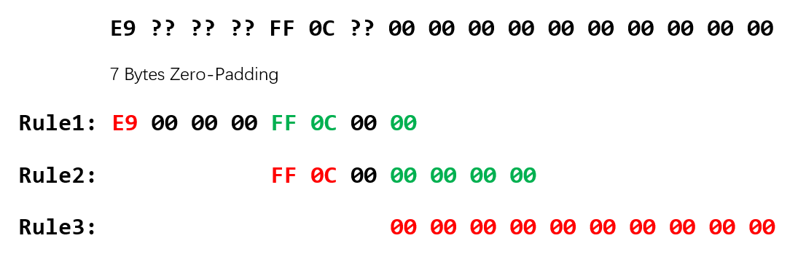

### n-gram相关

#### n-gram公式

$$
\begin{aligned}
P(ABCDEF) &= P(F|ABCDE) \ P(ABCDE)
\\
&= P(F|ABCDE) \ P(E|ABCD) \ P(ABCD)
\\
&= P(F|ABCDE) \ P(E|ABCD) \ P(D|ABC) \ P(ABC)
\\
for \ 4-gram \ & \approx P(F|CDE) \ P(E|BCD) \ P(D|ABC) \ P(ABC)
\end{aligned}
$$

#### n-gram数据库

##### 原始格式

| 键           | 值                                              |
| ----------- | ---------------------------------------------- |
| total       | 语料库总大小 C                                       |
| data        | 元组，序列ABCD的频数C(ABCD)与序列ABC的频数C(ABC)             |
| every_total | 各个长度的序列的频数（如对于4-gram的表，这里包含ABC AB BC和A B C的频数） |

##### 数据的使用方式

* total  提供整个语料库的序列个数

* data  用于计算条件概率，因为 $P(D|ABC) = \frac{P(ABCD)}{P(ABC)} = \frac{C(ABCD)}{C(ABC)}$

* every_total  用于计算先验概率，这里存储了所有1~n-1的序列频数

#### n-gram库的选择

##### 选择方式

逻辑在GetProbability函数中

若当前输入的序列长度大于等于 `slice_length`（对于4-gram即为4），则n为`slice_length`，否则n为序列长度，并且选用对应n-gram的数据库

一个例子，若序列长度为3，则使用3-gram计算为

$$
P(ABC) = P(C|AB) \ P(AB)
$$

使用2-gram计算为

$$
P(ABC) = P(C|B) \ P(B|A) \ P(A)
$$

自然使用3-gram理论上可以获得更高的准确性

##### 误差

分别使用2 3 4 gram对P(ABCD)进行计算

$$
\begin{aligned}
P(ABCD) &= P(D|ABC) \ P(ABC) \\
P(ABCD) &= P(D|BC) \ P(C|AB) \ P(AB) \\
P(ABCD) &= P(D|C) \ P(C|B) \ P(B|A) \ P(A)
\end{aligned}
$$

#### smooth

当n-gram库中没有出现对应序列时的处理方法

目前使用的方法是n-gram回退法，即若4-gram没有，使用3-gram计算；若再没有使用2-gram。若连1-gram都没有，直接赋0。此外还有一个默认参数low指定最低使用的gram数，若在该数以上的gram库都没有，则直接赋0

$$
\begin{aligned}
P(D|ABC) &= \frac{P(ABCD)}{P(ABC)}
\\
回退到3-gram &\approx \frac{P(D|BC)\ P(C|AB)\ P(AB)}{P(C|AB)\ P(AB)} = P(D|BC)
\end{aligned}
$$

关于smoothing方法

[自然语言处理之数据平滑方法_liulei0824的博客-CSDN博客_平滑的方法](https://blog.csdn.net/fuermolei/article/details/81353746)

[Kneser Ney Smoothing 平滑算法2019-04-28 - 简书](https://www.jianshu.com/p/044108934966)

[学习笔记-n-gram中的平滑方法 - 简书](https://www.jianshu.com/p/8c53125154c0)

https://zhuanlan.zhihu.com/p/97892874

https://zhuanlan.zhihu.com/p/96826160

#### 一些优化方向

##### 在序列中加入起始与终结符

在NLP中通常会在序列中加入起始与终结符，标识句子的起始与终结。由于函数也有prologue和epilogue，所以加入起始与终结符应该可以优化结果

### TODO

#### 20221107

##### 概率计算

* 新的wildcard概率计算方式
  
  原来的方法十分简单粗暴，直接将wildcard填0
  
  新算法的思路如下，例如bytes_rule
  
  ```
  E9 ?? ?? ?? FF 0C ?? 00 00 00 00 00 00 00 00 00 00
  ```
  
  首先按照wildcard对原来的bytes_rule进行切分
  
  ```
  E9
  FF 0C
  00 00 00 00 00 00 00 00 00 00
  ```
  
  此后对每个切分后的bytes_rule单独做预测反汇编。注意，这里在进行预测反汇编时补充的指令padding应考虑wildcard个数以及其后的其他bytes_rule，如目前的代码实现中，padding的数量为7Bytes，且为00的padding，这里应该如下处理。注意，红色标明了当前主要需计算的预测反汇编的字节，绿色则标明了为了使得结果符合bytes_rule，对padding字节进行的修改
  
  
  
  将每个切分的bytes_rule分别进行预测反汇编后，分别得到对应每条bytes_rule的预测反汇编集合。下一步的工作是筛选所有可能组合成一个指令序列的预测反汇编结果

* 对于包含立即数的反汇编结果，应当大幅减少其对应的先验概率，例如bytes_rule
  
  ```
  E9 ?? ?? ?? FF 0C ?? 00 00 00 00 00 00 00 00 00 00
  ```
  
  直接的反汇编结果理论上应为
  
  ```
  E9 ?? ?? ?? FF    jmp 0xff??????
  0C ??             or al, ??
  00 00             add byte ptr [eax], al
  00 00             add byte ptr [eax], al
  00 00             add byte ptr [eax], al
  00 00             add byte ptr [eax], al
  00 00             add byte ptr [eax], al
  ```
  
  理论上计算得到的概率应该为
  
  ```
  令 
  P0 = P( [jmp imm] [or reg, imm] [add mem, reg] )
  P1 = P( [add mem, reg] | [jmp imm] [or reg, imm] [add mem, reg] )
  P2 = P( [add mem, reg] | [or reg, imm] [add mem, reg] [add mem, reg] )
  P3 = P( [add mem, reg] | [add mem, reg] [add mem, reg] [add mem, reg] )
  
  P = P0 * P1 * P2 * P3 * P3
  ```
  
  但这里有个问题，就是没有考虑到imm带来的先验概率的改变，如这里第一个jmp指定了立即数的高8位，因此先验概率应该是 `jmp imm` 指令先验概率的 $\frac{1}{256}$
  
  因此需要对原来的概率进行修正，修正的思路如下：
  
  * 若要修正的指令出现在先验概率的计算式中，则直接乘对应立即数匹配到的概率，即
    
    $$
    P(ABC)^* = P(imm) * P(ABC)
    $$
    
    ```
    如上面的例子
    P( [jmp 0xff??????] [or reg, imm] [add mem, reg] )
    = 1/256 * P( [jmp imm] [or reg, imm] [add mem, reg] )
    ```
  
  * 若要修正的指令出现在条件概率的计算式中，由于条件概率的计算式为
    
    $$
    P(D|ABC) = \frac{P(ABCD)}{P(ABC)}
    $$
    
    * 若要修正的指令为D，则P(ABCD)需要乘上立即数匹配的概率，而P(ABC)不需要，因此
      
      $$
      P(D|ABC)^* = P(imm) * P(D|ABC)
      $$
    
    * 若要修正的指令在ABC中，则分子分母都需要乘上立即数匹配的概率，则结果与原式相同
      
      $$
      P(D|ABC)^* = P(D|ABC)
      $$

##### Yara规则

* 对相邻的wildcard进行合并，如
  
  ```
  0A [0-1] [2-4] 0B
  ```
  
  计算方式很简单，将多个相邻的下界相加，上界相加。0+2=2  1+4=5，所以
  
  ```
  [0-1] [2-4] -> [2-5]
  ```
